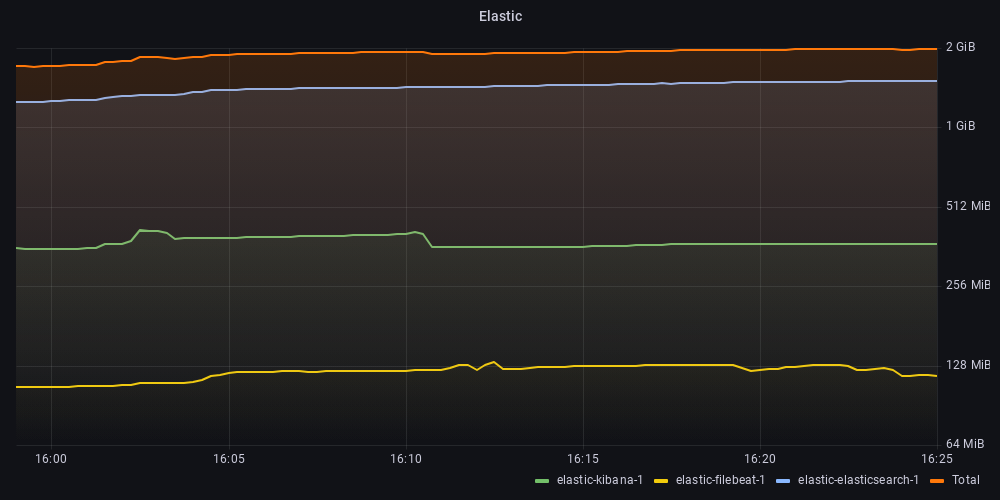
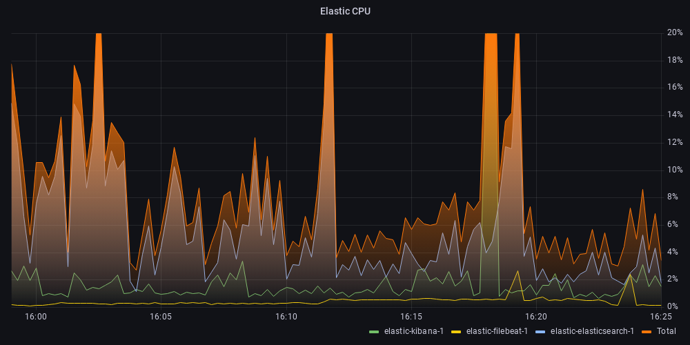

# Elastic (ELK) Logging stack

This is a very simple setup for an Elastic based logging stack, which I used to evaluate the resource usage of an idle cluster.

Note, since this disables xpack security and https/ssl, uses hardcoded passwords along with the fact that it's a single-node cluster you probably should avoid using it for anything, anything really.

It consists of the following containers
- ElasticSearch 8.6.1
- Kibana 8.6.1
- Filebeat 8.6.1
- `mingrammer/flog` to generate some logs

## Usage

To start the cluster run the following.

```sh
docker compose up
```

And after a minute or so everything should be up and running, and you should be able to open the kibana log window and see the logs generated by flog appear there.

```sh
open localhost:5601/app/logs/stream
```

## Resources
To test the resource usage I started the monitoring stack in `../monitoring`, then ran the `run-test.sh` script. The ElasticSearch instance is configured with a heap  size of `512m` as lower sizes caused it to exit due to OutOfMemoryError.



