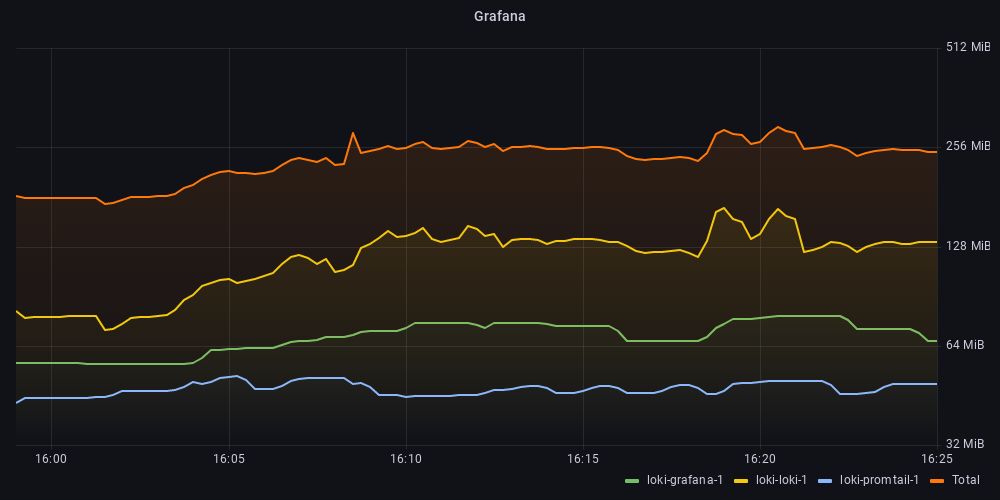
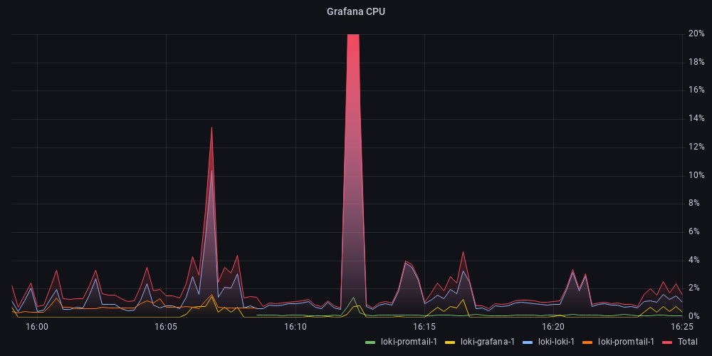

# Grafana (Loki) Logging

This logging setup uses a Grafana Labs based stack. It is a very simple stack that uses a single node loki instance, promtail to forward logs from the docker socket and finally Grafana to provide a query interface.

It consists of the following containers:
- grafana/loki:2.7.1
- grafana/promtail:2.7.1
- grafana/grafana:9.3.6

## Usage

To start the cluster and view the logs run the following.

```sh
docker compose up

# Open the Grafana logging dashboard
open http://localhost:3101/d/iwz2q-AVk
```

## Resources
To test the resource usage I started the monitoring stack in `../monitoring`, then ran the `run-test.sh` script.



