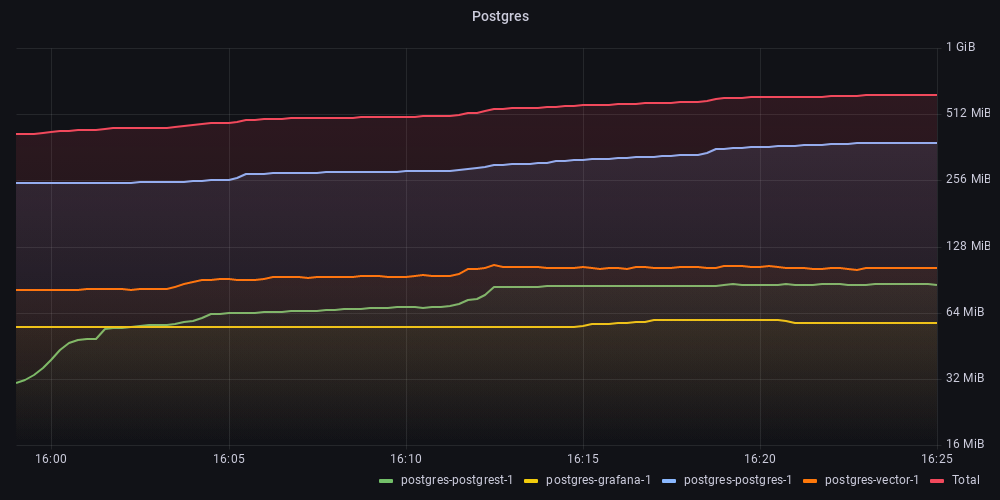
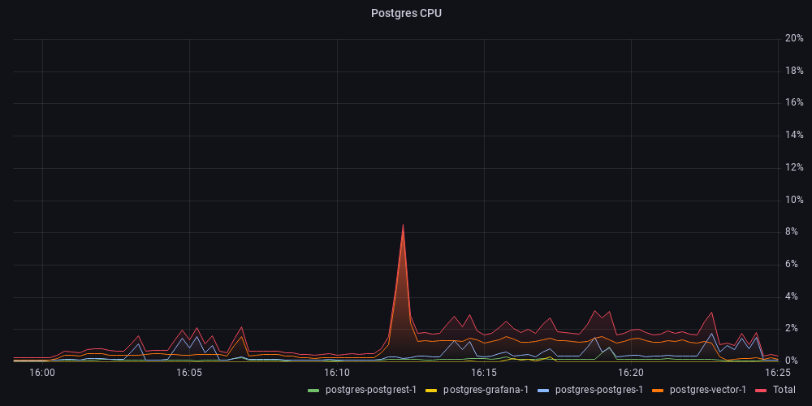

# PostgreSQL Logging

This contains a very simple logging stack using Postgres with TimescaleDB as the main log storage. It reads the logs from the docker socket using vector, and pushes them into the database via postgREST. Finally it visualizes the logs using Grafana.

In summary, it consists of the following containers:
- `timescale/timescaledb` as a log database and index 
- `timberio/vector` to forward the logs from docker to postgREST
- `postgrest/postgrest` to handle log ingestion from vector to postgres
- `grafana/grafana` to query and view the logs

## Usage

To start the cluster and view the logs run the following.

```sh
docker compose up

# Open the Grafana logging dashboard
open http://localhost:5430/d/bl926aAVz
```

## Resources
To test the resource usage I started the monitoring stack in `../monitoring`, then ran the `run-test.sh` script.



