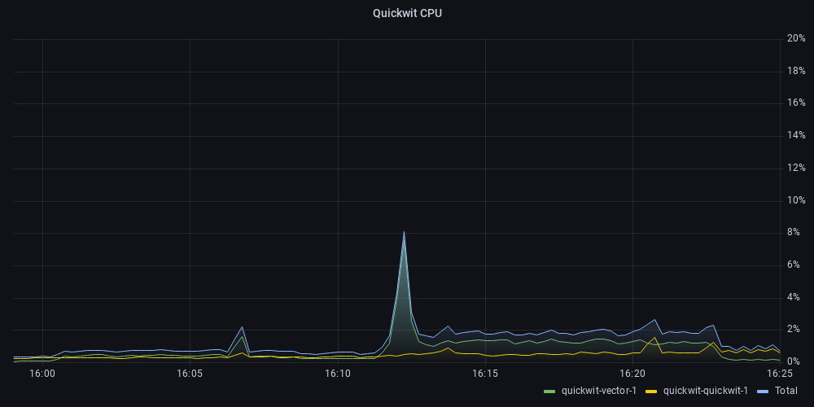

# Quickwit Logging

This contains a simple logging stack using Quickwit to store and query the logs, Vector to read logs from the docker socket and push them to Quickwit.

## Usage

To start the cluster and view the logs run the following.

```sh
docker compose up

# Open Quickwit in a browser
open http://localhost:7280
```

## Resources
To test the resource usage I started the monitoring stack in `../monitoring`, then ran the `run-test.sh` script.




